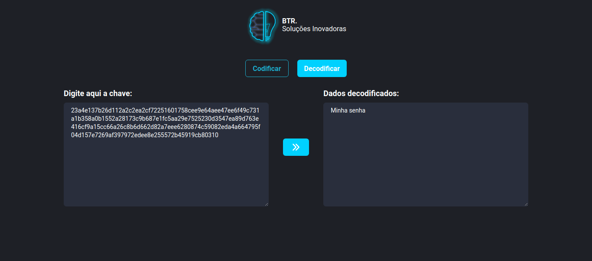
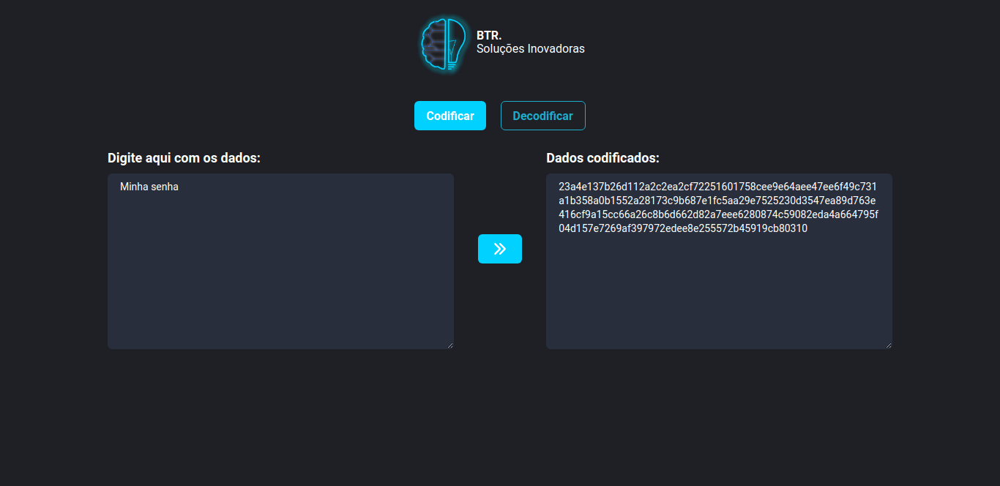

<h2 align="center">BS-Crypto</h2>

<h3 align="center">
  <a href="#information_source-iniciando">Iniciando</a>&nbsp;|&nbsp;
  <a href="#information_source-imagens">Imagens</a>&nbsp;|&nbsp;
  <a href="#information_source-sobre">Sobre</a>&nbsp;|&nbsp;
  <a href="#interrobang-motivo">Motivo</a>&nbsp;|&nbsp;
  <a href="#seedling-requisitos-mínimos">Requisitos</a>&nbsp;|&nbsp;
  <a href="#rocket-tecnologias-utilizadas">Tecnologias</a>&nbsp;|&nbsp;
</h3>

___

## :rocket: Iniciando projeto

- Instale as dependecias:

```bash
npm install
# or
yarn
```

- Rode o projeto:

```bash
npm run dev
# or
yarn dev
```

## :fireworks: Imagens

<h3>Desktop</h3>
<div justify="center">
  
  
</div>

<h3>Mobile</h3>


## :information_source: Sobre

Este projeto se trata de um codificador e decodificador de dados.

## :interrobang: Motivo

Principal motivição do projeto é possuir meu próprio codificador de dados.


## :rocket: Tecnologias Utilizadas 

O projeto foi desenvolvido utilizando as seguintes tecnologias

- Next.JS
- ReactJS
- Typescript
- Chakra UI
- Crypto
